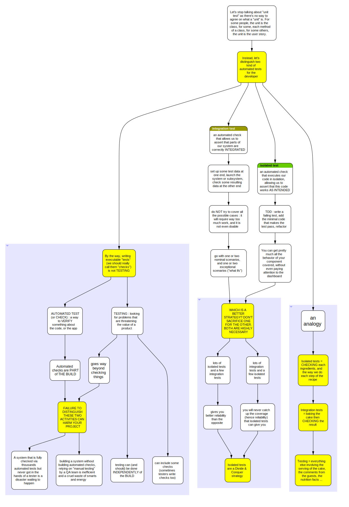

# :a series of diagrams about test granularity
## Test granularity 
### Generalities

### Testing a simple function in isolation

### Testing a feature in isolation

### Using a stub test double

### Usins a mock test double

## An example

### First Design

### Second Design

### Third Design

